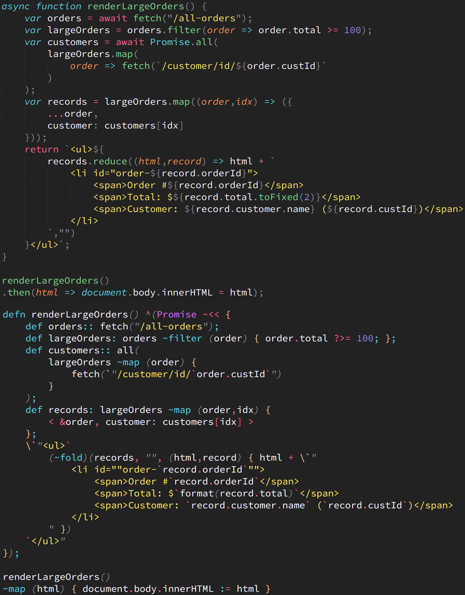

# Foi-vs-JS Cheatsheet

The following (incomplete) is a **Foi** cheatsheet: a list of comparisons between JS operators/keywords/features and the somewhat-equivalents in **Foi**.

<table>
  <thead>
    <tr><th>JS</th><th>Foi</th><th>Notes</th></tr>
  </thead>
  <tbody>
    <tr><td><code>// line comment</code> <code>/* block comment */</code></td><td><code>// line comment</code> <code>/// block comment ///</code></td><td>Code Comment</td></tr>
    <tr><td><code>var .. =</code> <code>let .. =</code> <code>const .. =</code></td><td><code>def .. :</code></td><td>Variable Definition</td></tr>
    <tr><td><code>null</code> <code>undefined</code></td><td><code>empty</code></td><td>Empty Value Literal</td></tr>
    <tr><td><code>true</code><code>false</code></td><td><code>true</code> <code>false</code></td><td>Boolean Literal</td></tr>
    <tr><td><code>123</code> <code>3.14</code> <code>-42</code></td><td><code>123</code> <code>3.14</code> <code>-42</code></td><td>Number Literal</td></tr>
    <tr><td><code>0o127</code> <code>0h3a6</code> <code>0b10110</code></td><td><code>\o127</code> <code>\h3a6</code> <code>\b10110</code></td><td>Octal/Hex/Binary Literal</td></tr>
    <tr><td><code>1_234_567.890_123</code></td><td><code>\1_234_567.890_123</code></td><td>Readable Number Literal</td></tr>
    <tr><td><code>12345678901234567890n</code></td><td><code>\@12345678901234567890</code></td><td>Big Integer Literal</td></tr>
    <tr><td><code>"hello"</code> <code>'hello'</code> <code>`hello`</code></td><td><code>"hello"</code></td><td>String Literal</td></tr>
    <tr><td><code>`string ${interpolation}`</code></td><td><code>\`"string `interpolation`"</code></td><td>Interpolated String Literal</td></tr>
    <tr><td><code>{ x: 2 }</code></td><td><code>&lt; x: 2 &gt;</code></td><td>Object (Foi Record)</td></tr>
    <tr><td><code>{ [propName]: 2 }</code></td><td><code>&lt; %propName: 2 &gt;</code></td><td>Computed Property Name</td></tr>
    <tr><td><code>[ 2, 3 ]</code></td><td><code>&lt; 2, 3 &gt;</code></td><td>Array (Foi Tuple)</td></tr>
    <tr><td><code>{ ...obj }</code></td><td><code>&lt; &obj &gt;</code></td><td>Object Spread (Foi Record Pick)</td></tr>
    <tr><td><code>{ prop: obj.prop }</code></td><td><code>&lt; &obj.prop &gt;</code></td><td>Object Pick</td></tr>
    <tr><td><code>[ ...arr ]</code></td><td><code>&lt; &arr &gt;</code></td><td>Array Spread (Foi Tuple Pick)</td></tr>
    <tr><td><code>{ x }</code></td><td><code>&lt; :x &gt;</code></td><td>Concise Property</td></tr>
    <tr><td><code>obj.prop</code> <code>obj[propName]</code></td><td><code>obj.prop</code> <code>obj[propName]</code></td><td>Object Property Access</td></tr>
    <tr><td><code>arr[3]</code></td><td><code>arr.3</code> <code>arr[3]</code></td><td>Array Index Access</td></tr>
    <tr><td>arr.at(-1)</td><td><code>arr.-1</code></td><td>Relative Array Index Access</td></tr>
    <tr><td><code>arr.slice(2,5)</code></td><td><code>arr.[2..5]</code></td><td>Array Range Access</td></tr>
    <tr><td><code>new Map([[ obj, 42 ]])</code></td><td><code>&lt; %obj: 42 &gt;</code></td><td>Map (Foi Record)</td></tr>
    <tr><td><code>new Set([ 1, 1, 2, 2 ])</code></td><td><code>&lt;[ 1, 1, 2, 2 ]&gt;</code></td><td>Set (Foi Tuple -- with duplicate filtering)</td></tr>
    <tr><td><code>=</code></td><td><code>:=</code></td><td>Assignment</td></tr>
    <tr><td><code>var { x } = ..</code> <code>var [ x ] = ..</code></td><td><code>def &lt; x &gt;: ..</code></td><td>Destructuring</td></tr>
    <tr><td><code>!x</code></td><td><code>!x</code></td><td>Boolean Negate</td></tr>
    <tr><td><code>!!x</code> <code>Boolean(x)</code></td><td><code>?x</code></td><td>Boolean Coerce</td></tr>
    <tr><td><code>&amp;&amp;</code></td><td><code>?and</code></td><td>Boolean AND</td></tr>
    <tr><td><code>||</code></td><td><code>?or</code></td><td>Boolean OR</td></tr>
    <tr><td><code>!( &amp;&amp; )</code></td><td><code>!and</code></td><td>Boolean NOT AND (Foi NAND)</td></tr>
    <tr><td><code>!( || )</code></td><td><code>!or</code></td><td>Boolean NOT OR (Foi NOR)</td></tr>
    <tr><td><code>==</code></td><td><code>?=</code></td><td>Equality</td></tr>
    <tr><td><code>!=</code></td><td><code>!=</code></td><td>Inequality</td></tr>
    <tr><td><code>== null</code></td><td><code>?empty</code></td><td>Is <code>null</code> (Foi <code>empty</code>)</td></tr>
    <tr><td><code>!= null</code></td><td><code>!empty</code></td><td>Is Not <code>null</code> (Foi <code>! empty</code>)</td></tr>
    <tr><td><code>&gt;</code></td><td><code>?&gt;</code></td><td>Greater Than</td></tr>
    <tr><td><code>&gt;=</code></td><td><code>?&gt;=</code></td><td>Greater Than / Equal</td></tr>
    <tr><td><code>&lt;</code></td><td><code>?&lt;</code></td><td>Less Than</td></tr>
    <tr><td><code>&lt;=</code></td><td><code>?&lt;=</code></td><td>Less Than / Equal</td></tr>
    <tr><td><code>!( &gt )</code></td><td><code>!&gt;</code></td><td>Not Greater Than</td></tr>
    <tr><td><code>!( &gt;= )</code></td><td><code>!&gt;=</code></td><td>Not Greater Than / Equal</td></tr>
    <tr><td><code>!( &lt; )</code></td><td><code>!&lt;</code></td><td>Not Less Than</td></tr>
    <tr><td><code>!( &lt;= )</code></td><td><code>!&lt;=</code></td><td>Not Less Than / Equal</td></tr>
    <tr><td><code>&gt; &amp;&amp; &lt;</code></td><td><code>?&lt;&gt;</code></td><td>In Between, Not Inclusive </td></tr>
    <tr><td><code>&gt;= &amp;&amp; &lt;=</code></td><td><code>?&lt;=&gt;</code></td><td>In Between, Inclusive</td></tr>
    <tr><td><code>&lt; || &gt;</code></td><td><code>!&lt;&gt;</code></td><td>Not In Between, Not Inclusive </td></tr>
    <tr><td><code>&lt;= || &gt;=</code></td><td><code>!&lt;=&gt;</code></td><td>Not In Between, Inclusive</td></tr>
    <tr><td><code>+</code></td><td><code>+</code></td><td>Plus</td></tr>
    <tr><td><code>-</code></td><td><code>-</code></td><td>Minus</td></tr>
    <tr><td><code>*</code></td><td><code>*</code></td><td>Multiply</td></tr>
    <tr><td><code>/</code></td><td><code>/</code></td><td>Divide</td></tr>
    <tr><td><code>import .. from ..</code> <code>import { .. } from ..</code></td><td><code>def .. : import from ..</code> <code>def &lt; .. &gt;: import from ..</code></td><td>Module Import</td></tr>
    <tr><td><code>export ..</code> <code>export { .. }</code></td><td><code>export { .. }</code></td><td>Module Export</td></tr>
    <tr><td><code>function</code> <code>=></code></td><td><code>defn</code></td><td>Function Definition</td></tr>
    <tr><td><code>return</code> <code>=> ..</code></td><td><code>^</code></td><td>Function Return</td></tr>
    <tr><td><code>function myFunc(x = 0) ..</code></td><td><code>defn myFunc(x: 0) ..</code></td><td>Function Parameter Default</td></tr>
    <tr><td><code>function myFunc(...params) ..</code></td><td><code>defn myFunc(*params) ..</code></td><td>Function Rest Parameter</td></tr>
    <tr><td><code>myFunc(1,2,3)</code></td><td><code>myFunc(1,2,3)</code></td><td>Function Call</td></tr>
    <tr><td><code>myFunc(...args)</code></td><td><code>myFunc(...args)</code></td><td>Function Call Argument Spread</td></tr>
    <tr><td><code>.. ? .. : ..</code> <code>if</code> <code>if .. else if .. else</code> <code>switch .. case .. default</code></td><td><code>?{ ?[..]: .. ?: .. }</code> <code>?(..){ ?[..]: .. ?: .. }</code></td><td>Decision Making (Foi Pattern Matching)</td></tr>
    <tr><td><code>if (x > 0) myFunc(x)</code></td><td><code>?[x ?> 0]: myFunc(x)</code></td><td>Statement Guard Clause</td></tr>
    <tr><td><code>for (..)</code> <code>while (..)</code> <code>do .. while (..)</code></td><td><code>~each</code></td><td>Imperative Loop</td></tr>
    <tr><td><code>.map(..)</code></td><td><code>~map</code></td><td>Map (Foi Comprehension)</td></tr>
    <tr><td><code>.flatMap(..)</code></td><td><code>~flatMap</code> <code>~bind</code> <code>~chain</code> <code>~&lt;</code></td><td>Flat-Map (Foi Comprehension)</td></tr>
    <tr><td><code>.filter(..)</code></td><td><code>~filter</code></td><td>Filter (Foi Comprehension)</td></tr>
    <tr><td><code>.reduce(..)</code> <code>.reduceRight(..)</code></td><td><code>~fold</code> <code>~foldR</code></td><td>Reduce (Foi Fold)</td></tr>
    <tr><td><code>[...new Array(4)].map((v,i)=>i)</code></td><td><code>0..3</code></td><td>Integer Range List: 0,1,2,3</td></tr>
    <tr><td><code>(async function(){ var x = await y; .. })()</code></td><td><code>Promise ~&lt;&lt; (x:: y) { .. }</code></td><td>Async..Await (Foi Promise Do Comprehension)</td></tr>
    <tr><td><code>Promise.resolve(42)</code></td><td><code>Promise@42</code></td><td>Resolved Promise</td></tr>
    <tr><td><code>new Promise(res => { .. })</code></td><td><code>Promise(defn(res){ .. })</code></td><td>Promise Constructor</td></tr>
    <tr><td><code>const subj = {}; subj.pr = new Promise(res => { subj.resolve = res; })</code></td><td><code>def subj: PromiseSubject@;</code></td><td>Promise Subject</td></tr>
    <tr><td><code>function*</code> <code>async function*</code></td><td><code>Gen@ ..</code></td><td>Generator</td></tr>
    <tr><td><code>for (let x of it) { .. }</code> <code>for await (let x of it) { .. }</code></td><td><code>it ~&lt;* (x) { .. }</code></td><td>Iterator/Async Iterator Consumption (Foi Promise Do Loop Comprehension)</td></tr>
    <tr><td><code>Observable</code> <code>Stream</code></td><td><code>PushStream</code> <code>PullStream</code></td><td>Lazy/Concurrent Data</td></tr>
    <tr><td><code>42 |&gt; myFunc(#) |&gt; anotherFunc(#,2)</code></td><td><code>42 #&gt; myFunc #&gt; anotherFunc(#,2)</code></td><td>Pipeline (proposed for JS)</td></tr>
    <tr><td><code>var x: int = 42</code></td><td><code>def x: 42 :as int</code></td><td>TypeScript Static Annotation (Foi Value-Type Annotation)</td></tr>
    <tr><td><code>type MyType = ..</code></td><td><code>deft MyType ..</code></td><td>Custom Type Definition</td></tr>
    <tr><td>----------------</td><td>--------------------</td><td>--------------------</td></tr>
    <tr><td><code>NaN</code></td><td>(not in Foi)</td><td></td></tr>
    <tr><td><code>class ..</code></td><td>(not in Foi)</td><td></td></tr>
    <tr><td><code>this.</code></td><td>(not in Foi)</td><td></td></tr>
    <tr><td><code>try .. catch</code></td><td>(not in Foi)</td><td></td></tr>
    <tr><td><code>x &lt;&lt; y</code> <code>x &lt;&lt;&lt; y</code> <code>~x</code> <code>x % y</code> <code>x & y</code> <code>x | y</code> <code>x ^ y</code> <code>x?.y</code> <code>x?.[y]</code> <code>x?.(y)</code> <code>x ?? y</code></td><td>(not in Foi)</td><td></td></tr>
    <tr><td>----------------</td><td>--------------------</td><td>--------------------</td></tr>
    <tr><td>(not in JS)</td><td><code>|myFunc 1,2,3|</code> <code>|+ 1,2,3|</code></td><td>Lisp-like Function/Operator Invocation</td></tr>
    <tr><td>(proposed for JS)</td><td><code>|myFn 1,,|</code> <code>|myFn 1,,3|</code></td><td>Function Partial Application</td></tr>
    <tr><td>(not in JS)</td><td><code>|'myFn 3,2,1|</code></td><td>Function Reverse Application</td></tr>
    <tr><td>(not in JS)</td><td><code>|#&gt; 42,...fns|</code></td><td>Dynamic Pipeline</td></tr>
    <tr><td>(not in JS)</td><td><code>arr.<0,2,3></code> <code>obj.&lt;first,last,email&gt;</code></td><td>Record/Tuple Subset Selection</td></tr>
    <tr><td>(not in JS)</td><td><code>2..5</code> <code>"a".."f"</code></td><td>Range Of Sequential Values</td></tr>
    <tr><td>(not in JS)</td><td><code>:over (..)</code></td><td>Closure Side Effect Declaration</td></tr>
    <tr><td>(not in JS)</td><td><code>defn myFunc() ?[ .. ]: ..</code></td><td>Function Precondition</td></tr>
    <tr><td>(not in JS)</td><td><code><code>Promise ~&lt;* { .. }</code></code></td><td>Promise Looping</td></tr>
    <tr><td>(not in JS)</td><td><code>def myFunc: incVal +&gt; doubleVal +&gt; formatNum</code></td><td>Function Composition</td></tr>
    <tr><td>(not in JS)</td><td><code>defn myFunc(v) #&gt; incVal #&gt; doubleVal #&gt; formatNum</code></td><td>Pipeline Function</td></tr>
    <tr><td>(not in JS)</td><td><code>defn add(x)(y) ^x + y</code></td><td>Curried Function Declaration</td></tr>
    <tr><td>(not in JS)</td><td><code>Id</code> <code>Value</code> <code>Number</code> <code>None</code> <code>Maybe</code> <code>Either</code> <code>Left</code> <code>Right</code> <code>List</code> <code>IO</code> <code>Gen</code> <code>PushStream</code> <code>PullStream</code> <code>Channel</code> (CSP) <code>~ap</code> <code>~foldMap</code> <code>~cata</code> <code>~&lt;&lt;</td><td>Monads, Monadic Comprehensions</td></tr>
  </tbody>
</table>

## Comparision Examples

Here are some screenshots showing typical JS code (on top, in each image) to the equivalent **Foi** code (on bottom, in each image).

<table>
<tr>
    <td valign="top"></td>
    <td rowspan="2" valign="top"></td>
</tr>
<tr>
    <td></td>
</tr>
</table>

The syntax highlighting of the **Foi** code in these screenshots is produced by the [Foi-Toy tool](foi-toy/README.md) included in this repository.

You can find some [more examples of **Foi** code here](foi-toy/test).

## Guide

From here, you can proceed to the [Foi Guide](Foi-Guide.md) for a detailed exploration of the **Foi** language.

## License

All code and documentation are (c) 2022 Kyle Simpson and released under the [MIT License](http://getify.mit-license.org/). A copy of the MIT License [is also included](LICENSE.txt).
