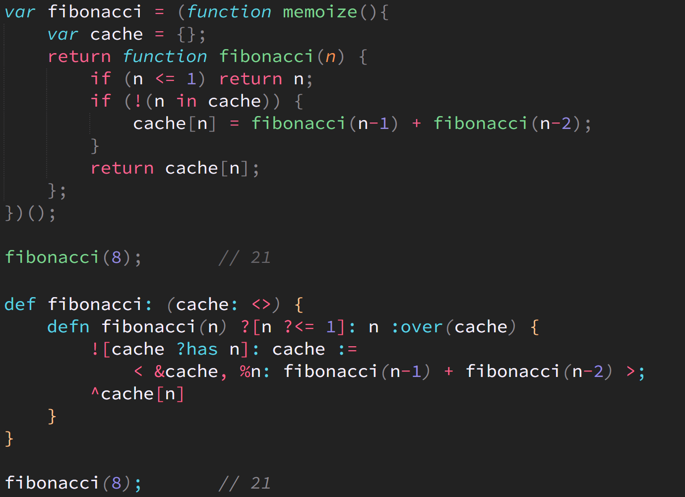

# Foi-vs-JS Cheatsheet

If you're familiar with JS and want to understand how to do something in **Foi** instead, the following is a lookup list of  JS features/idioms and their (somewhat) equivalents in **Foi**:

<table>
  <thead>
    <tr><th>JS</th><th>Foi</th><th>Notes</th></tr>
  </thead>
  <tbody>
    <tr><td><code>// line comment</code> <code>/* block comment */</code></td><td><code>// line comment</code> <code>/// block comment ///</code></td><td>Code Comment</td></tr>
    <tr><td><code>var .. =</code> <code>let .. =</code> <code>const .. =</code></td><td><code>def .. :</code></td><td>Variable Definition</td></tr>
    <tr><td><code>null</code> <code>undefined</code></td><td><code>empty</code></td><td>Empty Value Literal</td></tr>
    <tr><td><code>true</code><code>false</code></td><td><code>true</code> <code>false</code></td><td>Boolean Literal</td></tr>
    <tr><td><code>123</code> <code>3.14</code> <code>-42</code></td><td><code>123</code> <code>3.14</code> <code>-42</code></td><td>Number Literal</td></tr>
    <tr><td><code>0o127</code> <code>0h3a6</code> <code>0b10110</code></td><td><code>\o127</code> <code>\h3a6</code> <code>\b10110</code></td><td>Octal/Hex/Binary Literal</td></tr>
    <tr><td><code>1_234_567.890_123</code></td><td><code>\1_234_567.890_123</code></td><td>Readable Number Literal</td></tr>
    <tr><td><code>12345678901234567890n</code></td><td><code>\@12345678901234567890</code></td><td>Big Integer Literal</td></tr>
    <tr><td><code>"hello"</code> <code>'hello'</code> <code>`hello`</code></td><td><code>"hello"</code></td><td>String Literal</td></tr>
    <tr><td><code>`string ${interpolation}`</code></td><td><code>\`"string `interpolation`"</code></td><td>Interpolated String Literal</td></tr>
    <tr><td><code>{ x: 2 }</code></td><td><code>&lt; x: 2 &gt;</code></td><td>Object (Foi Record)</td></tr>
    <tr><td><code>{ [propName]: 2 }</code></td><td><code>&lt; %propName: 2 &gt;</code></td><td>Computed Property Name</td></tr>
    <tr><td><code>[ 2, 3 ]</code></td><td><code>&lt; 2, 3 &gt;</code></td><td>Array (Foi Tuple)</td></tr>
    <tr><td><code>arr.includes(x)</code></td><td><code>x ?in arr</code></td><td>Array Includes</td></tr>
    <tr><td><code>propName in obj</code></td><td><code>obj ?has propName</code></td><td>Object Property Exists</td></tr>
    <tr><td><code>{ ...obj }</code></td><td><code>&lt; &obj &gt;</code></td><td>Object Spread (Foi Record Pick)</td></tr>
    <tr><td><code>{ prop: obj.prop }</code></td><td><code>&lt; &obj.prop &gt;</code></td><td>Object Pick</td></tr>
    <tr><td><code>[ ...arr ]</code></td><td><code>&lt; &arr &gt;</code></td><td>Array Spread (Foi Tuple Pick)</td></tr>
    <tr><td><code>{ x }</code></td><td><code>&lt; :x &gt;</code></td><td>Concise Property</td></tr>
    <tr><td><code>obj.prop</code> <code>obj[propName]</code></td><td><code>obj.prop</code> <code>obj[propName]</code></td><td>Object Property Access</td></tr>
    <tr><td><code>arr[3]</code></td><td><code>arr.3</code> <code>arr[3]</code></td><td>Array Index Access</td></tr>
    <tr><td><code>arr.at(-1)</code></td><td><code>arr.-1</code></td><td>Relative Array Index Access</td></tr>
    <tr><td><code>arr.slice(2,6)</code></td><td><code>arr.[2..5]</code></td><td>Array Range Access</td></tr>
    <tr><td><code>new Map([[ obj, 42 ]])</code></td><td><code>&lt; %obj: 42 &gt;</code></td><td>Map (Foi Record)</td></tr>
    <tr><td><code>new Set([ 1, 1, 2, 2 ])</code></td><td><code>&lt;[ 1, 1, 2, 2 ]&gt;</code></td><td>Set (Foi Tuple -- with duplicate filtering)</td></tr>
    <tr><td><code>=</code></td><td><code>:=</code></td><td>Assignment</td></tr>
    <tr><td><code>var { x } = ..</code> <code>var [ x ] = ..</code></td><td><code>def &lt; x &gt;: ..</code></td><td>Destructuring</td></tr>
    <tr><td><code>!x</code></td><td><code>!x</code></td><td>Boolean Negate</td></tr>
    <tr><td><code>!!x</code> <code>Boolean(x)</code></td><td><code>?x</code></td><td>Boolean Coerce</td></tr>
    <tr><td><code>x &amp;&amp; y</code></td><td><code>x ?and y</code></td><td>Boolean AND</td></tr>
    <tr><td><code>x || y</code></td><td><code>x ?or y</code></td><td>Boolean OR</td></tr>
    <tr><td><code>!(x &amp;&amp; y)</code></td><td><code>x !and y</code></td><td>Boolean NOT AND (Foi NAND)</td></tr>
    <tr><td><code>!(x || y)</code></td><td><code>x !or y</code></td><td>Boolean NOT OR (Foi NOR)</td></tr>
    <tr><td><code>==</code></td><td><code>?=</code></td><td>Equality</td></tr>
    <tr><td><code>!=</code></td><td><code>!=</code></td><td>Inequality</td></tr>
    <tr><td><code>v == null</code></td><td><code>?empty v</code></td><td>Is <code>null</code> (Foi <code>empty</code>)</td></tr>
    <tr><td><code>v != null</code></td><td><code>!empty v</code></td><td>Is Not <code>null</code> (Foi <code>!= empty</code>)</td></tr>
    <tr><td><code>x &gt; y</code></td><td><code>x ?&gt; y</code></td><td>Greater Than</td></tr>
    <tr><td><code>!(x &gt; y)</code></td><td><code>x !&gt; y</code></td><td>Not Greater Than</td></tr>
    <tr><td><code>x &gt;= y</code></td><td><code>x ?&gt;= y</code></td><td>Greater Than / Equal</td></tr>
    <tr><td><code>!(x &gt;= y)</code></td><td><code>x !&gt;= y</code></td><td>Not Greater Than / Equal</td></tr>
    <tr><td><code>x &lt; y</code></td><td><code>x ?&lt; y</code></td><td>Less Than</td></tr>
    <tr><td><code>!(x &lt; y)</code></td><td><code>x !&lt; y</code></td><td>Not Less Than</td></tr>
    <tr><td><code>x &lt;= y</code></td><td><code>x ?&lt;= y</code></td><td>Less Than / Equal</td></tr>
    <tr><td><code>!(x &lt;= y)</code></td><td><code>x !&lt;= y</code></td><td>Not Less Than / Equal</td></tr>
    <tr><td><code>y &gt; x &amp;&amp; y &lt; z</code></td><td><code>(?&lt;&gt;)(x,y,z)</code></td><td>In Between, Not Inclusive </td></tr>
    <tr><td><code>y &gt;= x &amp;&amp; y &lt;= z</code></td><td><code>(?&lt;=&gt;)(x,y,z</code></td><td>In Between, Inclusive</td></tr>
    <tr><td><code>y &lt; x || y &gt; z</code></td><td><code>(!&lt;&gt;)(x,y,z)</code></td><td>Not In Between, Not Inclusive </td></tr>
    <tr><td><code>y &lt;= x || y &gt;= z</code></td><td><code>(!&lt;=&gt;)(x,y,z)</code></td><td>Not In Between, Inclusive</td></tr>
    <tr><td><code>+</code></td><td><code>+</code></td><td>Plus/Concatenation</td></tr>
    <tr><td><code>-</code></td><td><code>-</code></td><td>Minus</td></tr>
    <tr><td><code>*</code></td><td><code>*</code></td><td>Multiply</td></tr>
    <tr><td><code>/</code></td><td><code>/</code></td><td>Divide</td></tr>
    <tr><td><code>import .. from ..</code> <code>import { .. } from ..</code></td><td><code>def .. : import from ..</code> <code>def &lt; .. &gt;: import from ..</code></td><td>Module Import</td></tr>
    <tr><td><code>export ..</code> <code>export { .. }</code></td><td><code>export { .. }</code></td><td>Module Export</td></tr>
    <tr><td><code>function</code> <code>=></code></td><td><code>defn</code></td><td>Function Definition</td></tr>
    <tr><td><code>return</code> <code>=> ..</code></td><td><code>^</code></td><td>Function Return</td></tr>
    <tr><td><code>function myFunc(x = 0) ..</code></td><td><code>defn myFunc(x: 0) ..</code></td><td>Function Parameter Default</td></tr>
    <tr><td><code>function myFunc(...params) ..</code></td><td><code>defn myFunc(*params) ..</code></td><td>Function Rest Parameter</td></tr>
    <tr><td><code>myFunc = x => y => x * y</code></td><td><code>defn myFunc(x) ^defn(y) ^x * y</code></td><td>(Strict) Curried Function Declaration</td></tr>
    <tr><td><code>myFunc(1,2,3)</code></td><td><code>myFunc(1,2,3)</code></td><td>Function Call</td></tr>
    <tr><td><code>myFunc(...args)</code></td><td><code>myFunc(...args)</code></td><td>Function Call Argument Spread</td></tr>
    <tr><td><code>myFunc({ x: 1, y: 2 })</code></td><td><code>myFunc(x:1, y:2)</code></td><td>"Named Arguments" (at call-site) Idiom</td></tr>
    <tr><td><code>x > 0 ? y : z</code> <code>if (x > 0) y else z</code> <code>switch (true) case (x > 0): y; break; default: z</code></td><td><code>?{ ?[x ?> 0]: y; ?: z }</code> <code>?(x){ ?[?> 0]: y; ?: z }</code></td><td>Decision Making (Foi Pattern Matching)</td></tr>
    <tr><td><code>if (x > 0) myFunc(x)</code></td><td><code>?[x ?> 0]: myFunc(x)</code></td><td>Statement Guard Clause</td></tr>
    <tr><td><code>for (..)</code> <code>while (..)</code> <code>do .. while (..)</code></td><td><code>~each</code></td><td>Imperative Loop</td></tr>
    <tr><td><code>.map(..)</code></td><td><code>~map</code></td><td>Map (Foi Comprehension)</td></tr>
    <tr><td><code>.flatMap(..)</code></td><td><code>~flatMap</code> <code>~bind</code> <code>~chain</code> <code>~&lt;</code></td><td>Flat-Map (Foi Comprehension)</td></tr>
    <tr><td><code>.filter(..)</code></td><td><code>~filter</code></td><td>Filter (Foi Comprehension)</td></tr>
    <tr><td><code>.reduce(..)</code> <code>.reduceRight(..)</code></td><td><code>~fold</code> <code>~foldR</code></td><td>Reduce (Foi Fold)</td></tr>
    <tr><td><code>[...new Array(4)].map((v,i)=>i)</code></td><td><code>0..3</code></td><td>Integer Range List: 0,1,2,3</td></tr>
    <tr><td><code>(async function(){ var x = await y; .. })()</code></td><td><code>Promise ~&lt;&lt; (x:: y) { .. }</code></td><td>Async..Await (Foi Promise Do Comprehension)</td></tr>
    <tr><td><code>Promise.resolve(42)</code></td><td><code>Promise@42</code></td><td>Resolved Promise</td></tr>
    <tr><td><code>new Promise(res => { .. })</code></td><td><code>Promise(defn(res){ .. })</code></td><td>Promise Constructor</td></tr>
    <tr><td><code>const subj = {}; subj.pr = new Promise(res => { subj.resolve = res; })</code></td><td><code>def subj: PromiseSubject@;</code></td><td>Promise Subject</td></tr>
    <tr><td><code>function*</code> <code>async function*</code></td><td><code>Gen@ ..</code></td><td>Generator</td></tr>
    <tr><td><code>for (let x of it) { .. }</code> <code>for await (let x of it) { .. }</code></td><td><code>it ~&lt;* (x) { .. }</code></td><td>Iterator/Async Iterator Consumption (Foi Promise Do Loop Comprehension)</td></tr>
    <tr><td><code>Observable</code> <code>Stream</code></td><td><code>PushStream</code> <code>PullStream</code></td><td>Lazy/Concurrent Data</td></tr>
    <tr><td><code>42 |&gt; myFunc(#) |&gt; anotherFunc(#,2)</code></td><td><code>42 #&gt; myFunc #&gt; anotherFunc(#,2)</code></td><td>Pipeline (proposed for JS)</td></tr>
    <tr><td><code>var x: int = 42</code></td><td><code>def x: 42 :as int</code></td><td>TypeScript Static Annotation (Foi Value-Type Annotation)</td></tr>
    <tr><td><code>type MyType = ..</code></td><td><code>deft MyType ..</code></td><td>Custom Type Definition</td></tr>
    <tr><td>----------------</td><td>--------------------</td><td>--------------------</td></tr>
    <tr><td><code>NaN</code> <code>Infinity</code> <code>-Infinity</code></td><td>(not in Foi)</td><td></td></tr>
    <tr><td><code>new</code> <code>super</code> <code>class ..</code> <code>extends</code> <code>static</code> <code>this</code> <code>instanceof</code></td><td>(not in Foi)</td><td></td></tr>
    <tr><td><code>delete</code> <code>void</code> <code>typeof</code> <code>yield</code></td><td>(not in Foi)</td><td></td></tr>
    <tr><td><code>try .. catch</code></td><td>(not in Foi)</td><td></td></tr>
    <tr><td><code>x === y</code> <code>x++</code> <code>++x</code> <code>x--</code> <code>--x</code> <code>x += y</code> <code>x -= y</code> <code>x *= y</code> <code>x /= y</code> <code>x %= y</code> <code>x &= y</code> <code>x |= y</code> <code>x **= y</code> <code>x &amp;&amp;= y</code> <code>x ||= y</code> <code>x ??= y</code> <code>x &lt;&lt;= y</code> <code>x &gt;&gt;= y</code> <code>x &gt;&gt;&gt;= y</code> <code>x ** y</code> <code>x &lt;&lt; y</code> <code>x &gt;&gt; y</code> <code>x &gt;&gt;&gt; y</code> <code>~x</code> <code>x % y</code> <code>x &amp; y</code> <code>x | y</code> <code>x ^ y</code> <code>x?.y</code> <code>x?.[y]</code> <code>x?.(y)</code> <code>x ?? y</code></td><td>(not in Foi)</td><td></td></tr>
    <tr><td>----------------</td><td>--------------------</td><td>--------------------</td></tr>
    <tr><td>(not in JS)</td><td><code>(*)(2,3,4)</code></td><td>N-Ary Operator (as function) Invocation</td></tr>
    <tr><td>(proposed for JS)</td><td><code>myFn|1|</code> <code>myFn|1,,3|</code></td><td>Function Partial Application</td></tr>
    <tr><td>(not in JS)</td><td><code>myFn'(3,2,1)</code></td><td>Function Reverse Application</td></tr>
    <tr><td>(not in JS)</td><td><code>arr.<0,2,3></code> <code>obj.&lt;first,last,email&gt;</code></td><td>Record/Tuple Subset Selection</td></tr>
    <tr><td>(not in JS)</td><td><code>2..5</code> <code>"a".."f"</code></td><td>Range Of Sequential Values</td></tr>
    <tr><td>(not in JS)</td><td><code>:over (..)</code></td><td>Closure Side Effect Declaration</td></tr>
    <tr><td>(not in JS)</td><td><code>defn myFunc() ?[ .. ]: ..</code></td><td>Function Precondition</td></tr>
    <tr><td>(not in JS)</td><td><code>Promise ~&lt;* { .. }</code></td><td>Promise Looping</td></tr>
    <tr><td>(not in JS)</td><td><code>def myFunc: incVal +&gt; doubleVal +&gt; formatNum</code> <code>def myFunc: formatNum &lt;+ doubleVal &lt;+ incVal</code></td><td>Function Composition</td></tr>
    <tr><td>(not in JS)</td><td><code>defn myFunc(v) #&gt; incVal #&gt; doubleVal #&gt; formatNum</code></td><td>Pipeline Function</td></tr>
    <tr><td>(not in JS)</td><td><code>(#&gt;)(42,...fns)</code></td><td>Dynamic Pipeline</td></tr>
    <tr><td>(not in JS)</td><td><code>defn add(x)(y) ^x + y</code></td><td>(Loose) Curried Function Declaration</td></tr>
    <tr><td>(not in JS)</td><td><code>Id</code> <code>Value</code> <code>Number</code> <code>None</code> <code>Maybe</code> <code>Either</code> <code>Left</code> <code>Right</code> <code>List</code> <code>IO</code> <code>Gen</code> <code>PushStream</code> <code>PullStream</code> <code>Channel</code> (CSP) <code>~ap</code> <code>~foldMap</code> <code>~cata</code> <code>~&lt;&lt;</td><td>Monads, Monadic Comprehensions</td></tr>
  </tbody>
</table>

## Comparison Examples

Here are some screenshots showing typical JS code (on top or left, in each image) to the equivalent **Foi** code (on bottom or right, in each image).

<table>
<tr>
    <td></td>
    <td rowspan="2">
          </td>
</tr>
<tr>
    <td></td>
</tr>
<tr>
    <td></td>
</tr>
<tr>
    <td colspan="2"></td>
</tr>
</table>

The syntax highlighting of the **Foi** code in these screenshots is produced by the [Foi-Toy tool](foi-toy/README.md) included in this repository.

You can find some [more examples of **Foi** code here](foi-toy/test).

## Syntax Weight/Density

**Foi** more strongly favors the usage of symbolic operators over generic keywords (e.g. **Foi** `^` vs JS `return`). Symbol re-use in compound (multi-character) operators is also prioritized for creating a visual symmetry between related features (e.g., the common `?` in boolean operators like `?>`, `?<`, and `?=`). And **Foi** uses symbol visual semantics to signal behavior (e.g. `+>` pointing in left-to-right direction to indicate the flow of data). Lastly, **Foi** makes some choices in its operators (especially compound operators) that are unique/rare compared to other languages (e.g., `~<*`), and will thus be less familiar at first glance.

As such, **Foi** code may indeed appear to be more heavy/dense in its syntax when you first start reading it.

While it's important to admit the intentionality in these design decisions, it's also important to keep a full context for such analysis and opinion forming.

The following table is a comprehensive list of all non-alphanumeric symbols in JS, as well as in **Foi**, presented respectively in side-by-side columns. In many cases, the row pairings in this table attempt to match like features, but there are many JS or **Foi** features that are distinct and don't match up; those "random" row pairings are only to slot things into a table for counting purposes.

As a summary of the symbol counts below:

* JS has **79** distinct symbol sequences (single-character, or compound multi-character); there are another 12 proposed JS symbols (Stage 2 or 3 proposals, somewhat likely to happen).

    - 28 of them are single-character (plus 1 proposed)
    - 30 of them are double-character (plus 2 proposed)
    - 12 of them are triple-character (plus 3 proposed)
    - 9 of them are four+ characters (plus 6 proposed)
    - 182 total characters (plus 71 proposed characters)
    - Regular expression literals can't be length-analyzed

* **Foi** has **88** distinct symbol sequences.

    - 26 of them are single-character
    - 21 of them are double-character
    - 21 of them are triple-character
    - 20 of them are four+ characters
    - 260 total characters

As you can see, JS has **79** distinct symbols (**91** including likely-to-land future proposals), whereas **Foi** has **88** distinct symbols. Overall character count of all symbols is **253** in JS (proposals included) versus **260** for **Foi**.

So, is **Foi** more syntactically heavy/verbose than JS? Perhaps a little bit, yes. But probably not significantly moreso, no.

Of course, these symbol/character counts don't tell the whole story. It's also important to understand the usage frequency of each type and length of symbol/operator. Moreover, the "symbol density" of a code base depends on how many of these symbols would appear near/adjacent to each other, with other intervening alphanumeric characters "spreading" them out or not.

Both of these factors are highly dependent on the code base/style, so can't be objectively compared in a universal sense.

<table>
    <tr>
        <td>JS Symbol/Operator</td><td>Description</td>
        <td></td>
        <td>Foi Symbol/Operator</td><td>Description</td>
    </tr>
    <tr>
        <td><code>@</code></td><td>Decorator (proposed)</td>
        <td></td>
        <td><code>@</code></td><td>Monad Constructor</td>
    </tr>
    <tr>
        <td><code>#</code></td><td>Private Member</td>
        <td></td>
        <td><code>#</code></td><td>Pipeline Topic</td>
    </tr>
    <tr>
        <td><code>_</code></td><td>Identifier Character</td>
        <td></td>
        <td><code>_</code></td><td>Identifier Character</td>
    </tr>
    <tr>
        <td><code>$</code></td><td>Identifier Character</td>
        <td></td>
        <td><code>$+</code></td><td>Set Append</td>
    </tr>
    <tr>
        <td><code>,</code></td><td>Comma</td>
        <td></td>
        <td><code>,</code></td><td>Comma</td>
    </tr>
    <tr>
        <td><code>.</code></td><td>Property Access</td>
        <td></td>
        <td><code>.</code></td><td>Property Access</td>
    </tr>
    <tr>
        <td><code>;</code></td><td>Statement End Semicolon</td>
        <td></td>
        <td><code>;</code></td><td>Statement End Semicolon</td>
    </tr>
    <tr>
        <td><code>:</code></td><td>Property Definition</td>
        <td></td>
        <td><code>:</code></td><td>Initial Assignment, Property Definition</td>
    </tr>
    <tr>
        <td><code>`</code></td><td>Template String Delimiter</td>
        <td></td>
        <td><code>`</code></td><td>Interpolated String Delimiter, Interpolated Expression Delimiter</td>
    </tr>
    <tr>
        <td><code>"</code></td><td>String Delimiter</td>
        <td></td>
        <td><code>"</code></td><td>String Delimiter</td>
    </tr>
    <tr>
        <td><code>'</code></td><td>String Delimiter</td>
        <td></td>
        <td><code>'</code></td><td>Function Call Argument Reversal</td>
    </tr>
    <tr>
        <td><code>\</code></td><td>Escape</td>
        <td></td>
        <td><code>\</code></td><td>Escape</td>
    </tr>
    <tr>
        <td><code>~</code></td><td>Bitwise Negate (1's complement)</td>
        <td></td>
        <td><code>\@</code></td><td>Large Number Escape (monadic)</td>
    </tr>
    <tr>
        <td><code>!!</code> <code>!</code></td><td>Boolean Cast / Negate</td>
        <td></td>
        <td><code>?</code> <code>!</code></td><td>Boolean Cast / Negate</td>
    </tr>
    <tr>
        <td><code>%</code> <code>%=</code></td><td>Remainder / Assignment</td>
        <td></td>
        <td><code>%</code></td><td>Computed Property Name</td>
    </tr>
    <tr>
        <td><code>^</code> <code>^=</code></td><td>Bitwise Negate / Assignment</td>
        <td></td>
        <td><code>^</code></td><td>Return (function value)</td>
    </tr>
    <tr>
        <td><code>&</code> <code>&=</code></td><td>Bitwise And / Assignment</td>
        <td></td>
        <td><code>&</code></td><td>Pick (record/tuple value)</td>
    </tr>
    <tr>
        <td><code>+</code> <code>+=</code></td><td>Addition / Assignment</td>
        <td></td>
        <td><code>+</code></td><td>Addition</td>
    </tr>
    <tr>
        <td><code>-</code> <code>-=</code></td><td>Subtraction / Assignment</td>
        <td></td>
        <td><code>-</code></td><td>Subtraction</td>
    </tr>
    <tr>
        <td><code>*</code> <code>*=</code></td><td>Multiplication / Assignment</td>
        <td></td>
        <td><code>*</code></td><td>Multiplication</td>
    </tr>
    <tr>
        <td><code>/</code> <code>/=</code></td><td>Divide / Assignment</td>
        <td></td>
        <td><code>/</code></td><td>Divide</td>
    </tr>
    <tr>
        <td><code>*</code> <code>*=</code></td><td>Multiplication / Assignment</td>
        <td></td>
        <td><code>*</code></td><td>Multiplication</td>
    </tr>
    <tr>
        <td><code>(  )</code></td><td>Expression Grouping, Function Call Arguments</td>
        <td></td>
        <td><code>(  )</code></td><td>Expression Grouping, Function Call Arguments</td>
    </tr>
    <tr>
        <td><code>[  ]</code></td><td>Array Literals, Property Access</td>
        <td></td>
        <td><code>[  ]</code></td><td>Property Access</td>
    </tr>
    <tr>
        <td><code>{  }</code></td><td>Object Literals, Blocks</td>
        <td></td>
        <td><code>{  }</code></td><td>Blocks</td>
    </tr>
    <tr>
        <td><code>|</code> <code>|=</code></td><td>Bitwise Or / Assignment</td>
        <td></td>
        <td><code>|  |</code></td><td>Function Call Partial Application</td>
    </tr>
    <tr>
        <td><code>#{  }</code> <code>#[  ]</code></td><td>Record / Tuple (proposed)</td>
        <td></td>
        <td><code>&lt;  &gt;</code></td><td>Record, Tuple</td>
    </tr>
    <tr>
        <td><code>**</code> <code>**=</code></td><td>Exponentiation / Assignment</td>
        <td></td>
        <td><code>&lt;[  ]&gt;</code></td><td>Set</td>
    </tr>
    <tr>
        <td><code>=</code></td><td>(Re-)Assignment</td>
        <td></td>
        <td><code>:=</code></td><td>Re-Assignment</td>
    </tr>
    <tr>
        <td><code>==</code> <code>!=</code></td><td>Equality / Inequality</td>
        <td></td>
        <td><code>?=</code> <code>!=</code></td><td>Equality / Inequality</td>
    </tr>
    <tr>
        <td><code>===</code> <code>!==</code></td><td>Strict Equality / Inequality</td>
        <td></td>
        <td><code>?$=</code> <code>!$=</code></td><td>Set Equality / Inequality</td>
    </tr>
    <tr>
        <td><code>&lt;</code> <code>!(x < y)</code></td><td>Less Than / Not Less Than</td>
        <td></td>
        <td><code>?&lt;</code> <code>!&lt;</code></td><td>Less Than / Not Less Than</td>
    </tr>
    <tr>
        <td><code>&lt;=</code> <code>!(x <= y)</code></td><td>Less Than Or Equal / Not Less Than Or Equal</td>
        <td></td>
        <td><code>?&lt;=</code> <code>!&lt;=</code></td><td>Less Than Or Equal / Not Less Than Or Equal</td>
    </tr>
    <tr>
        <td><code>&gt;</code> <code>!(x > y)</code></td><td>Greater Than / Not Greater Than</td>
        <td></td>
        <td><code>?&gt;</code> <code>!&gt;</code></td><td>Greater Than / Not Greater Than</td>
    </tr>
    <tr>
        <td><code>&gt;=</code> <code>!(x >= y)</code></td><td>Greater Than Or Equal / Not Greater Than Or Equal</td>
        <td></td>
        <td><code>?&gt;=</code> <code>!&gt;=</code></td><td>Greater Than Or Equal / Not Greater Than Or Equal</td>
    </tr>
    <tr>
        <td><code>=></code></td><td>Arrow Function</td>
        <td></td>
        <td><code>?&lt;=&gt;</code> <code>!&lt;=&gt;</code></td><td>Between (inclusive) / Not Between</td>
    </tr>
    <tr>
        <td><code>&&</code> <code>&&=</code></td><td>Boolean And / Assignment</td>
        <td></td>
        <td><code>?&lt;&gt;</code> <code>!&lt;&gt;</code></td><td>Between (non-inclusive) / Not Between</td>
    </tr>
    <tr>
        <td><code>||</code> <code>||=</code></td><td>Boolean Or / Assignment</td>
        <td></td>
        <td><code>..</code></td><td>Range / Slice</td>
    </tr>
    <tr>
        <td><code>//</code> <code>/*</code> <code>*/</code></td><td>Line Comment / Multiline Comment</td>
        <td></td>
        <td><code>//</code> <code>///</code></td><td>Line Comment / Multiline Comment</td>
    </tr>
    <tr>
        <td><code>...</code></td><td>Spread / Rest</td>
        <td></td>
        <td><code>...</code></td><td>Spread / Gather</td>
    </tr>
    <tr>
        <td><code>\u</code></td><td>Unicode Escape</td>
        <td></td>
        <td><code>\u</code></td><td>Unicode Escape</td>
    </tr>
    <tr>
        <td><code>0o</code> <code>0O</code></td><td>Octal Number Prefix</td>
        <td></td>
        <td><code>\o</code></td><td>Octal Number Prefix</td>
    </tr>
    <tr>
        <td><code>0b</code> <code>0B</code></td><td>Binary Number Prefix</td>
        <td></td>
        <td><code>\b</code></td><td>Binary Number Prefix</td>
    </tr>
    <tr>
        <td><code>0x</code> <code>0X</code></td><td>Hexadecimal Number Prefix</td>
        <td></td>
        <td><code>\h</code></td><td>Hexadecimal Number Prefix</td>
    </tr>
    <tr>
        <td><code>|&gt;</code></td><td>Pipeline (proposed)</td>
        <td></td>
        <td><code>#&gt;</code></td><td>Pipeline</td>
    </tr>
    <tr>
        <td><code>%%</code></td><td>Pipeline Topic Marker (proposed)</td>
        <td></td>
        <td><code>::</code></td><td>Do-Style Chain Assignment</td>
    </tr>
    <tr>
        <td><code>?</code></td><td>Ternary Conditional</td>
        <td></td>
        <td><code>?{  }</code></td><td>Pattern Match Expression (Independent)</td>
    </tr>
    <tr>
        <td><code>?.</code> <code>?.[</code> <code>?.(</code></td><td>Optional Property Access</td>
        <td></td>
        <td><code>?(  ){  }</code></td><td>Pattern Match Expression (Dependent)</td>
    </tr>
    <tr>
        <td><code>??</code> <code>??=</code></td><td>Nullish-Coalescing / Assignment</td>
        <td></td>
        <td><code>?[  ]</code></td><td>Guard Clause, Pattern Match Conditional, Function Precondition</td>
    </tr>
    <tr>
        <td><code>&gt;&gt;</code> <code>&gt;&gt;=</code></td><td>Bitwise Shift Right / Assignment</td>
        <td></td>
        <td><code>~&lt;</code></td><td>Chain/Bind/FlatMap Comprehension (Terse)</td>
    </tr>
    <tr>
        <td><code>&gt;&gt;&gt;</code> <code>&gt;&gt;&gt;=</code></td><td>Bitwise Shift Right (Zero Padded) / Assignment</td>
        <td></td>
        <td><code>~&lt;*</code></td><td>Looping Do-Syntax (monadic)</td>
    </tr>
    <tr>
        <td><code>&lt;&lt;</code> <code>&lt;&lt;=</code></td><td>Bitwise Shift Left / Assignment</td>
        <td></td>
        <td><code>~&lt;&lt;</code></td><td>Do-Syntax (monadic)</td>
    </tr>
    <tr>
        <td><code>++</code></td><td>(Pre, Post) Increment</td>
        <td></td>
        <td><code>+&gt;</code></td><td>Compose (left-to-right)</td>
    </tr>
    <tr>
        <td><code>--</code></td><td>(Pre, Post) Decrement</td>
        <td></td>
        <td><code>&lt;+</code></td><td>Compose (right-to-left)</td>
    </tr>
    <tr>
        <td><code>function*</code> <code>yield*</code> <code>import.meta</code> <code>new.target</code>
(proposed) <code>!in</code> <code>!instanceof</code> <code>function.sent</code> <code>await.all</code> <code>await.race</code> <code>await.allSettled</code> <code>await.any</code></td><td>Keyword+Symbol (hybrid)</td>
        <td></td>
        <td><code>~each</code> <code>~map</code> <code>~filter</code> <code>~fold ~foldMap</code> <code>~foldR</code> <code>~chain</code> <code>~bind</code> <code>~flatMap</code> <code>~ap</code> <code>~cata</code> <code>:as</code> <code>:over</code> <code>?empty</code> <code>!empty</code> <code>?and</code> <code>!and</code> <code>?or</code> <code>!or</code> <code>?as</code> <code>!as</code> <code>?in</code> <code>!in</code> <code>?has</code> <code>!has</code></td><td>Keyword+Symbol (hybrid)</td>
    </tr>
    <tr>
        <td><code>${  }</code></td><td>Interpolated Expression Delimiter</td>
        <td></td>
        <td></td><td></td>
    </tr>
    <tr>
        <td><code>/p*[^a](?&lt;tt&gt;er){1,3}n/</code></td><td>Regular Expression Literals</td>
        <td></td>
        <td></td><td></td>
    </tr>
</table>

The question that matters the most is: "Does Foi allow me to express and understand programs better?" And you'll only be able to judge that properly once you learn and practice with it, so don't rush to judgement at first glance!

## Further Details

Now check out the [Foi Guide](Foi-Guide.md) for a detailed exploration of the language.

For implementers or language design enthusiasts, a [formal grammar specification](Grammar.md) is in progress.

## License

All code and documentation are (c) 2022-2023 Kyle Simpson and released under the [MIT License](http://getify.mit-license.org/). A copy of the MIT License [is also included](LICENSE.txt).
