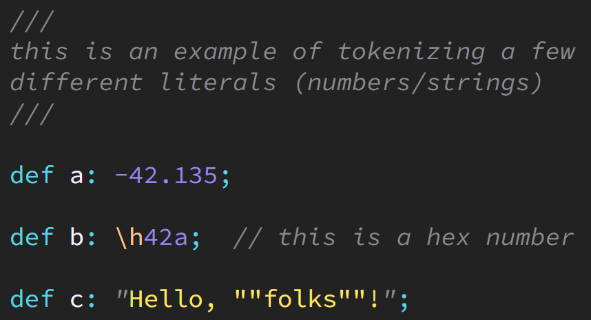

# Foi-Toy

----

[ONLINE FOI-TOY](https://toy.foi-lang.com)

----

This is an experimental tool for *toying* around with **Foi** code as it's being developed.

Foi-Toy is available as an [online playground](https://toy.foi-lang.com) or as a [CLI tool](#to-use).

## Features

Main features of Foi-Toy:

1. Foi-Toy tokenizes a **Foi** file -- tokens are objects that identify chunks of characters from the file as having some meaning, such as a `+` operator of a `foo` identifier. Tokenization (technically, "lexing") is the first important step in parsing/compiling a program.

2. With the optional `--color` CLI parameter, the output of Foi-Toy switches from the tokens to syntax-highlighted HTML/CSS. The output is a fully formed HTML document suitable for a file (to be served to and rendered in a browser).

3. The optional `--validate` CLI parameter validates the provided **Foi** code against [the formal language grammar](../Grammar.md).

    Validation is not a full compilation of a **Foi** program. It *does* use a parser built directly from the official grammar, but it does not (yet) do any semenctic enforcement (lexical analysis, type checking, etc).

    If the validator rejects a set of **Foi** code, then it's definitely invalid. However, if the validator accepts a set of **Foi** code, that means it's well-formed syntax and likely ***mostly*** valid -- it might still fail to fully compile with the eventual official compiler.

4. The optional `--ast` CLI parameter output the official AST from the parser instead of the token stream.

Above functionality of Foi-Toy is subject to change at any time.

## Output

Example:

```java
///
this is an example of tokenizing a few
different literals (numbers/strings)
///

def a: -42.135;

def b: \h42a;  // this is a hex number

def c: "Hello, ""folks""!";
```

That code currently tokenizes as:

```js
{
  type: 'Comment',
  value: '///\n' +
    'this is an example of tokenizing a few\n' +
    'different literals (numbers/strings)\n' +
    '///',
  start: 0,
  end: 82
}
{ type: 'Whitespace', value: '\n\n', start: 83, end: 84 }
{ type: 'Keyword', value: 'def', start: 85, end: 87 }
{ type: 'Whitespace', value: ' ', start: 88, end: 88 }
{ type: 'General', value: 'a', start: 89, end: 89 }
{ type: 'Colon', value: ':', start: 90, end: 90 }
{ type: 'Whitespace', value: ' ', start: 91, end: 91 }
{ type: 'Number', value: '-42.135', start: 92, end: 98 }
{ type: 'Semicolon', value: ';', start: 99, end: 99 }
{ type: 'Whitespace', value: '\n\n', start: 100, end: 101 }
{ type: 'Keyword', value: 'def', start: 102, end: 104 }
{ type: 'Whitespace', value: ' ', start: 105, end: 105 }
{ type: 'General', value: 'b', start: 106, end: 106 }
{ type: 'Colon', value: ':', start: 107, end: 107 }
{ type: 'Whitespace', value: ' ', start: 108, end: 108 }
{ type: 'Escape', value: '\\h', start: 109, end: 110 }
{ type: 'Number', value: '42a', start: 111, end: 113 }
{ type: 'Semicolon', value: ';', start: 114, end: 114 }
{ type: 'Whitespace', value: '  ', start: 115, end: 116 }
{
  type: 'Comment',
  value: '// this is a hex number',
  start: 117,
  end: 139
}
{ type: 'Whitespace', value: '\n\n', start: 140, end: 141 }
{ type: 'Keyword', value: 'def', start: 142, end: 144 }
{ type: 'Whitespace', value: ' ', start: 145, end: 145 }
{ type: 'General', value: 'c', start: 146, end: 146 }
{ type: 'Colon', value: ':', start: 147, end: 147 }
{ type: 'Whitespace', value: ' ', start: 148, end: 148 }
{ type: 'DoubleQuote', value: '"', start: 149, end: 149 }
{ type: 'String', value: 'Hello, ', start: 150, end: 156 }
{ type: 'StringEscapedChar', value: '""', start: 157, end: 158 }
{ type: 'String', value: 'folks', start: 159, end: 163 }
{ type: 'StringEscapedChar', value: '""', start: 164, end: 165 }
{ type: 'String', value: '!', start: 166, end: 166 }
{ type: 'DoubleQuote', value: '"', start: 167, end: 167 }
{ type: 'Semicolon', value: ';', start: 168, end: 168 }
```

If you include the `--color` parameter on the CLI command, the output will instead be the syntax-highlighted HTML/CSS, which (for the above code) looks like:

```html
<!-- ... -->

<i class="t0" title="COMMENT">///
this is an example of tokenizing a few
different literals (numbers/strings)
///</i>

<i class="t6" title="KEYWORD">def</i> <i class="t1" title="GENERAL">a</i><i class="t6" title="COLON">:</i> <i class="t7" title="NUMBER">-42.135</i><i class="t6" title="SEMICOLON">;</i>

<i class="t6" title="KEYWORD">def</i> <i class="t1" title="GENERAL">b</i><i class="t6" title="COLON">:</i> <i class="t3" title="ESCAPE">\h</i><i class="t7" title="NUMBER">42a</i><i class="t6" title="SEMICOLON">;</i>  <i class="t0" title="COMMENT">// this is a hex number</i>

<i class="t6" title="KEYWORD">def</i> <i class="t1" title="GENERAL">c</i><i class="t6" title="COLON">:</i> <i class="t0" title="DOUBLE_QUOTE">"</i><i class="t2" title="STRING">Hello, </i><i class="t2" title="STRING_ESCAPED_CHAR">""</i><i class="t2" title="STRING">folks</i><i class="t2" title="STRING_ESCAPED_CHAR">""</i><i class="t2" title="STRING">!</i><i class="t0" title="DOUBLE_QUOTE">"</i><i class="t6" title="SEMICOLON">;</i>

<!-- ... -->
```

That HTML/CSS looks like this when rendered in a browser:

<p>
<a href="foi-toy-highlighting.png" target="_blank"></a>
</p>

As shown, the syntax highlighting currently only uses the [Monokai Pro](https://monokai.pro/) dark theme (with "Spectrum" filter) colors.

If you validate the code with the optional `--validate` CLI parameter, while the validator is running you will see:

```
Validating...
```

If validation passes, you will then see:

```
Validating... OK!
..
..
```

The expected tokens or syntax highlighting will then be printed after this message.

However, if validation fails, you will instead see something like this:

```
Validating...
Parse error: Foi parse failed: unexpected Equal("=") at char 91 (token 6)
  at line 6, column 7
  6 | def a = 2;
            ^
```

This error message indicates that the `=` token is not allowed here -- instead the grammar expects a `:`, a comment (`///` or `//`), or whitespace.

Tokens/AST/syntax highlighting output are skipped if the validation fails.

## To Use

You can [play with Foi-Toy online here](https://toy.foi-lang.com), or use the CLI tool.

To use the CLI tool of Foi-Toy, save **Foi** code in a file -- generally with a `.foi` filename extension, but you can use whatever you like.

Then invoke `node cli.js --file={FILE-PATH}` with a path to the file you want to check. Foi-Toy will default to printing out a list of tokens that were processed from the file.

The `--color` parameter optionally switches output to syntax highlighting (via HTML/CSS), which you can redirect to a `.html` file to view/render in the browser.

The `--validate` parameter optionally applies grammar validation to the provided **Foi** code, and only outputs the tokens or syntax highlighting if the validation passes. Otherwise, an error is printed indicating where in the provided code the grammar failed validation (and a hint at what's expected there). Validation is currently quite slow ([see above explanation](#features)).

The `--ast` parameter switches output to the parsed AST (in pretty-printed JSON form).

## Tests

There are several test files provided in `./test/` that illustrate some of the syntactic edge cases for tokenizing **Foi** code, especially escaped number literals and escaped string literals (including interpolated string literals).

## License

[](LICENSE.txt)

All code and documentation are (c) 2022-2023 Kyle Simpson and released under the [MIT License](http://getify.mit-license.org/). A copy of the MIT License [is also included](../LICENSE.txt).
